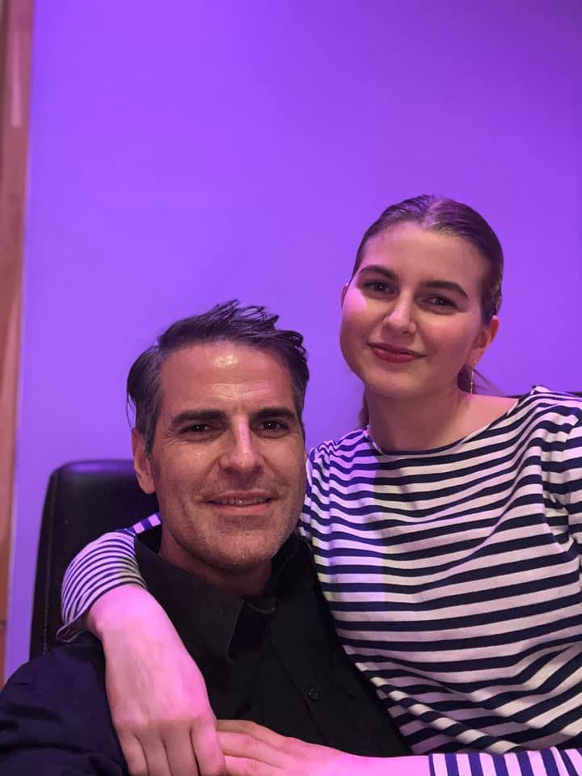

## Zipminator

In this space, explore the breadth of my 20+ years of experience in applied behavioral analysis, cybersecurity, and software development. Uncover the story behind the `Zipminator` software I developed at NAV- a cyber-security, password protecting encrypting DataFrames, GDPR/Privacy complience checker with self-destructing functionalitises.    ,

As a firm believer in social responsibility, I dedicate a portion of this website to my charity work and ongoing commitment to helping those in need. Join me in my efforts to create positive change and empower others to reach their full potential.
Feel free to browse, learn, and connect with me as you explore the various facets of my life and work. Whether you are drawn to my artistic creations or intrigued by my technical expertise, I invite you to share in my journey and passion for learning, innovation, and positive impact.

As a professional artist, data scientist, and devoted father, I am driven by a desire to create lasting impact, empower others, and drive transformative technologies. This space serves as a reflection of my interdisciplinary background, diverse skillset, and the projects that have shaped my journey.

Here, you will find a showcase of some of my Artwork, highlighting my love for `fluid art`, `NFT`, `Cryptography`, `design, and modeling techniques`. Explore both my Analytical Mindset and also my creative side and discover the captivating pieces that have been a significant part of my personal and professional growth.

Furthermore delve into the fascinating world of Quantum Information and the Hardware of Quantum Computers, as I share my insights and knowledge on cutting-edge technologies. Learn about my academic background in Applied Mathematics, Mechanics & Numerical Physics (MSc), Civil Engineering - Constructional techniques with High performance prestressed concrete, Continuum Mechanics covering Solid Mechanics & Fluid Mechanics, Computational Fluid Dynamics and *professional certifications and specialisations* in Mathematics for Machine Learning, Deep Reinforcement Learning, Quantum Machine Learning, and more than a decade with thousands of hours spent on the Architecture, Algorithms, Protocols, Quantum Interenet and Quantum Computers with a special emphasis on how to naively engineer and scale up Fault Tolerent Topological Quantum Computers with braiding of Anyonic Qubits (and Majorana Zero Bound).

In this space, explore the breadth of my 20+ years of experience in applied behavioral analysis, cybersecurity, and software development. Uncover the story behind the `Zipminator` software I developed at NAV- a cyber-security, password protecting encrypting DataFrames, GDPR/Privacy complience checker with self-destructing functionalitises.    ,


---
Here, you will find a showcase of some of my Artwork, highlighting my love for `Art & Science`. How I approach, start and finnish off a creative processes end-to-end, and discover how I made some of the pieces that have been a significant part of my personal and professional growth, and that I personally have found captivating. <br>

```{grid-item-card}
:shadow: md


```

```{note} Improvements!
Any typos or any shape of improvements are more than highly appreciated! 
> **Daniel Mo Houshmand** <br> **mobile:** $+47 98079896$ <br> **email**: `mo@daria.com`
```

[tegenskole.no](http://www.tegneskole.no/)

---

```{grid-item-card}
:shadow: md


```

```{tableofcontents}
```

```{admonition} Explanation
Explanation We can think of the repeater protocol as being divided into two smaller protocols. First, Alice and the repeater generate shared entanglement. Then, Bob and the repeater generate shared entanglement, which they use to teleport half of the Alice/repeater entangled state to Bob

- [ ] It is not possible to read out a superposition of spin states.
- [ ] Three quantum dots are required to perform this readout protocol.
- [ ] Magnetic noise can prevent the spin-up electron to tunnel out, since the Lorentz force accelerates the electron perpendicular to the direction of motion.
- [x] A spin-down electron can acquire the energy necessary to tunnel out of the dot from thermal fluctuations.
```

::::{grid} 2
:reverse:

:::{grid-item-card}
:columns: 4
:class: sd-m-auto



:::

:::{grid-item}
:columns: 8
:class: sd-fs-3
Welcome to my personal homepage, where I share my passions, experiences, and knowledge in the realms of Art, Artificial Intelligence, and Quantum Information. As a professional artist, data scientist, and devoted father, I am driven by a desire to create lasting impact, empower others, and drive transformative technologies. This space serves as a reflection of my interdisciplinary background, diverse skillset, and the projects that have shaped me. <br>

Sincerely yours, <br>

- Daniel Mo Houshmand
- `mo@daria.com`
- mob: $+47 98079896$

```{button-ref} intro
:ref-type: doc
:color: primary
:class: sd-rounded-pill float-left


Introduction
```

% The SVG rendering breaks latex builds for the GitHub badge, so only include in HTML

::::@

```{grid-item-card} sd-avatar-xl

```

---

```{admination} Work in progress
- This site is in its infancy and under development, mostly in English but some minor parts of it is in Norwegian at the moment for courses tutoring in **Fluid Art** at [tegenskole.no](http://www.tegneskole.no/) <br> 
- The rest is a combination of experience, educations and project in the realm Art, Applied Behavioral Analysis, Data Science and Computational with Applied Mathematics, Mechanics, Numerical Phuysics and some sub fields of Artificial Intelligence. 
- In my attempt to grasp the fundamentals of Quantum Computing, Quantum Computers and Quantum Machine Learning I have literally been taken thousand of pages of notes, codes and other recourses wher I have worked through tons of exercises. All that will be the heart of what I want to share with the readers in this jupyterbook format that enables flexibility to build a more instructively, interactive and visually appealing book at a later stage to make it easier to grasp for others who want to learn more about these subjects so you don't suffer as much as I did due to the complexity and hardness of it. 
- However, I have to painfully admit that this is not an easy to read or grasp subject, and you will no matter patiently work hard to fascilitate the subjects to be sufficiently matured. To cliche; The more regularly you work through exercises and read other resources the faster and heavier you will comprehend. 
- in Norwegian that is in the process of being translated to English.
Any errors, typos or any shape of improvements are more than highly appreciated! <br>

Kind regards 

- **Daniel Mo Houshmand** 
- **mo@daria.com**
- **mob: $+47 98079896$**
```

---

::::{grid} 2
:reverse:

:::{grid-item}
:columns: 4
:class: sd-m-auto


:::

:::{grid-item}
:columns: 8
:class: sd-fs-3
Build beautiful, publication-quality books and documents from computational content.

```{button-ref} intro
:ref-type: doc
:color: primary
:class: sd-rounded-pill float-left


Introduction
```

:::

::::

---
::::{grid} 2
:reverse:

:::{grid-item}
:columns: 4
:class: sd-m-auto


:::

:::{grid-item}
:columns: 8
:class: sd-fs-3

Welcome to my personal homepage, where I share my passions, experiences, and knowledge in the realms of Art, Artificial Intelligence, and Quantum Information. As a professional artist, data scientist, and devoted father, I am driven by a desire to create lasting impact, empower others, and drive transformative technologies.

```{button-ref} intro
:ref-type: doc
:color: primary
:class: sd-rounded-pill float-left
Mo Houshmand
```

:::

---

---

```{grid-item-card} sd-avatar-xl

```

---


---


::::{grid} 2
:reverse:

:::{grid-item}
:columns: 4
:class: sd-m-auto


:::

::::

::::{grid} 2
:reverse:

:::{grid-item}
:columns: 4
:class: sd-avatar-xl

:::

:::{grid-item}
:columns: 8
:class: sd-fs-3
Welcome to my personal homepage, where I share my passions, experiences, and knowledge in the realms of Art, Artificial Intelligence, and Quantum Information. As a professional artist, data scientist, and devoted father, I am driven by a desire to create lasting impact, empower others, and drive transformative technologies. This space serves as a reflection of my interdisciplinary background, diverse skillset, and the projects that have shaped me. <br>

:ref-type: doc
:color: primary
:class: sd-rounded-pill float-left
Get started
:::
::::

<br>


---

s a firm believer in social responsibility, a portion of this website will dedicate to my charity work and ongoing commitment to helping those in need. Join me in my efforts to create positive change and empower others to reach their full potential.

I am also a strong believer in the power of interdisciplinary collaboration and the potential of emerging technologies to create positive changes. Here, you will find a showcase of some of my Artwork, highlighting my love for `Art & Science`. How I approach, start and finnish off a creative processes end-to-end, and discover how I made some of the pieces that have been a significant part of my personal and professional growth, and that I personally have found captivating. <br>

Especially I will emphesise my passion for Quantum Computing, Quantum Machine Learning and the Hardware of Quantum Computers.

Fascinated by the intersection between science and art, turbulence flow and quantum mechanics, led me into deep trouble by digging into both. In the following I will share how I got drawn into the world of Quantum Computers, from fascination of High Performance materials and High Performance Computation, that eventually led me into the quantum world and ambitiously hairy obsessed to build a quantum cmputers. With like any other subjects, building a Quantum Computer requires solid knowledge and extreme efforts which eventually led me into the Hardware of Quantum Computers and Quantum Machine Learning. But first how I was mesmerized by the beauty of the Navier-Stokes equations and the art of turbulence flow that later on led me into the quantum world.

1. The artistic part of it in how to prepare acrylic colours with certain viscosities preparing them ready to blend into unique pieces of art.
2. Secondly the mathematics behind, and the accociated numerical techniques - *Computational Fluid Dynamics* (`CFD`) and *Direct Numerical Simulation* (`DNS`),

Both computational techniques in numerical physics exclusively dedicated to soutions of the Navier-Stokes equations, either solving them approximately with CFD or directly with DNS - the holy grail of the governing equations of motions explicitly dedicated to turbulens flows and an extremely reserved and even more expensive technique that only a few in the world have had the resources to simulate).

Feel free to browse, learn, and connect with me as you explore the various facets of my life and work. Whether you are drawn to my artistic creations or intrigued by my technical expertise, I invite you to share in my journey and passion for learning, innovation, and positive impact.
As an ardent believer in social responsibility, a significant portion of this website is dedicated to my charitable work and ongoing commitment to assist those in need. I invite you to join me in my efforts to effect positive change and empower others to reach their full potential.

I hold a strong conviction in the power of interdisciplinary collaboration and the potential of emerging technologies to instigate positive transformations. Here, you will find a showcase of my artwork, emphasizing my passion for the intersection of Art & Science. I invite you to explore my creative process from inception to completion, and discover how I created pieces that have been instrumental in my personal and professional growth, and which I find especially captivating. Particularly, I will emphasize my enthusiasm for Art (FLuid Art), Fluid Mechanics (Turbulence flow), Data Science, Quantum Computing, Quantum Machine Learning, and the Hardware of Quantum Computers.

I am deeply fascinated by the intersection of science and art, turbulence flow and quantum mechanics, a curiosity that has led me on a journey of extensive exploration. I will share how I was drawn into the realm of Quantum Computers, starting with my fascination for High-Performance materials and High-Performance Computation with Computational Fluid Dynamics (CFD) Simulations of Turbulence Flows from macroscopic certainty to where classical physics breaks with continuum hypothesis to microscopic uncertainty and the quantum world. Like any ambitious endeavor, building a Quantum Computer requires solid knowledge and extreme effort, which eventually led me into the hardware of Quantum Computers and Quantum Machine Learning. But first, let me share how I was captivated by the beauty of the Navier-Stokes equations and the art of turbulence flow, which later guided me into the quantum domain.

1. I will delve into the artistic aspects of preparing acrylic colors with specific viscosities, ready to blend into unique pieces of art.
2. I will also discuss the underlying mathematics and associated numerical techniques - Computational Fluid Dynamics (CFD) and Direct Numerical Simulation (DNS). Both these computational techniques in numerical physics are exclusively dedicated to the solutions of the Navier-Stokes equations. They either solve them approximately with CFD or directly with DNS - the holy grail of the governing equations of motion explicitly dedicated to turbulent flows. DNS is an exceptionally intricate and expensive technique, with only a handful of people worldwide having the priviliged resources to simulate it.
3. Quantum Computers are the next generation of computers that will revolutionize the world as we know it. I will share my journey into the quantum realm, starting with the basics of quantum mechanics and quantum information, and eventually leading to the hardware of quantum computers and quantum machine learning.

Feel free to browse, learn, and connect with me as you explore the various facets of my life and work. Whether you're captivated by my artistic creations or intrigued by my technical expertise, I warmly invite you to embark on this journey with me

---

A
---
