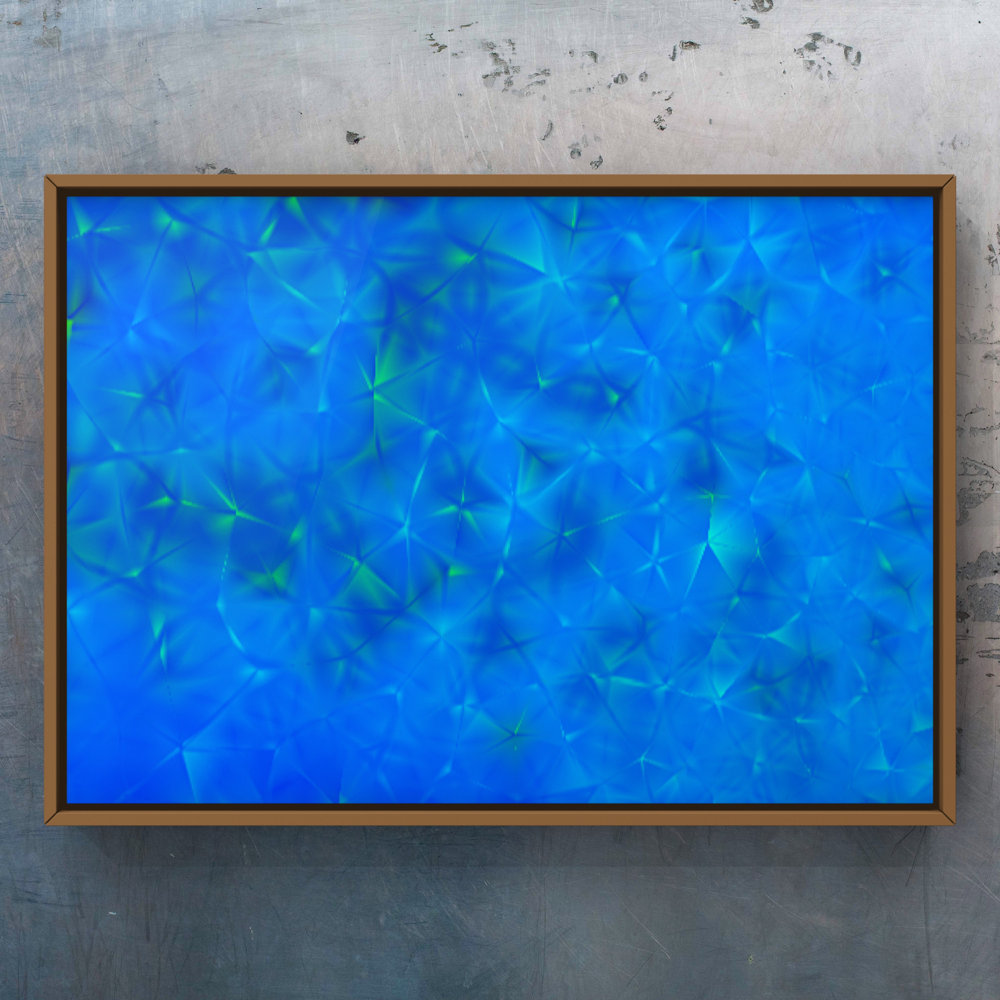

# Quantum Repeaters Further Explained
So, by using quantum repeaters, we can reduce the likelihood of losing quantum information due to decoherence or other errors, and thus can maintain a reliable quantum communication over long distances.
Why do we need a quantum repeater? Suppose you want to create entanglement between to places which are very far apart. That problem is, is that when you send a qubit it might lose its information during its travels. So the longer the distance the qubit has to travel, the more information might be lost. So we would like to minimize these distances as much as possible. And for this we can use repeaters. So how do these repeaters actually work? Let’s take a look. First of all we start with the two separate stations: we have station Alice and we have station Bob. Alice has two qubits which are entangled and Bob also has two qubits which are entangled, but the two stations are not entangled with each other. This is where the repeater comes in, which is shown here in the middle. So for the next step Alice and Bob both send one of their qubits to the repeater, which looks like this. Now important to note here is that there is still no entanglement between Alice and Bob, because these two particles are not entangled. To create this entanglement, we need to do operations. These clever operations are performed here, in this black box. This black box performs some operations on the qubits and eventually measures them, which results in the qubits in the repeater to collapse and generate an entangled state between Alice and Bob. So we can see now that the two qubits which were there in the middle initially are now gone and there is a pure entangled state between Alice and Bob. Now I know I might have been a little bit vague about what happened in the black box. But this is because what happens in the black box might be a little bit too technical. If you’re still interested in the details, I’d like to refer you to the link below which explains what happens in the repeaters in more detail.

- This space synthesizes my experiences, education, and projects across fields as diverse as *Art*, *Applied Behavioral Analysis*, *Quantum Information*, *Data Science*, and *Computational Science*, with a focus on *Applied Mathematics, Mechanics, and Numerical Physics*. You'll also find content touching on emerging and established subfields of *Artificial Intelligence*, particularly *Machine Learning* (`ML`), *Natural Language Processing* (`NLP`) including ..*Generation* (`NLG`), ..*Understanding* (`NLU`), *Deep Learning*, *Deep Reinforcement Learning* (`DRL`) and *Quantum Machine Learning* (`QML`).
- As I've endeavored to comprehend *Quantum Computing*, *Quantum Computers*, and *Quantum Machine Learning*, I've compiled thousands of pages of notes, codes, and other resources, laboring over a plethora of exercises. This is the very heart of my work that I want to share with readers in this interactive JupyterBook format, aiming to simplify and visually enhance the learning experience for those who wish to delve into these mind expandingly exciting but challenging subjects.
- I'm painfully aware that most of these topics are challenging to digest and demand dedicated effort. However, I have done my utmost to deconstruct these complex subjects into smaller, manageable pieces to facilitate a reverse-engineering approach for comprehension. These areas require unwavering patience and commitment to master, but be assured, with consistent practice and diligent exploration of resources, the speed and depth of your understanding will markedly increase.
- I welcome and appreciate all forms of feedback - if you spot any errors, typos, or see opportunities for improvement, please do not hesitate to share!

As a loud proponent of social responsibility, I dedicate a significant part of this website to some of my charitable initiatives and unwavering commitment to aiding those who need assistance. I encourage you to join me in sparking positive change and enpowering others to tap into their full potential. For now, you can directly either donate and or join one of my closest friends, Lindsay Sanner who initiated [Eco Moyo Education Center](https://www.ecomoyo.com) in Kenya and built a school for the homeless children and  in the community .

As an ardent champion of social responsibility, I've devoted a significant slice of this digital platform to showcase my charitable endeavors and unwavering commitment to extending a helping hand to those in need. My mission is not only about giving aid; it's about igniting change and empowering individuals to unlock their utmost potential.

But I can't do it alone, and that's where you come in. I warmly invite you to join me on this journey. Whether it's through a donation or your active participation, every little bit helps in setting forth waves of positive transformation.

One initiative particularly close to my heart is the Eco Moyo Education Center, pioneered by my esteemed friend Lindsay Sanner. Nestled in the heart of Kenya, Eco Moyo stands as a beacon of hope and learning for homeless children and the wider community. It's more than just a school; it's a nurturing environment that not only educates but also fosters creativity, instills confidence, and inculcates a respect for the environment.

By contributing to Eco Moyo, you're not just giving children access to education; you're helping to build a future where these children can grow, learn, and ultimately, transform their own communities. Let's join hands with Lindsay Sanner, support Eco Moyo, and together, we can make a real difference in the world.


-
- [](https://github.com/QDaria)
- [](https://github.com/MoHoushmand)
- [](https://www.facebook.com/DMoHoushmand)
- [](https://www.instagram.com/mo_houshmand/)
- [](https://www.instagram.com/mo_houshmand_art/)
- [](https://mybinder.org/v2/gh/QDaria/jbmo/HEAD)
- [](https://colab.research.google.com/github/googlecolab/colabtools/blob/main/notebooks/colab-github-demo.ipynb)


```{admonition} Site under development

Welcome to my personal space, reflecting my interdisciplinary background, diverse skillset, and some of the transformative projects that have shaped me.

- Most of the site is in English, though you will find minor sections in Norwegian, primarily catering to the courses I tutor in *Fluid Art* at [tegenskole.no](http://www.tegneskole.no/).
- This space synthesizes my experiences, education, and projects across fields as diverse as *Art*, *Applied Behavioral Analysis*, *Quantum Information*, *Data Science*, and *Computational Science*, with a focus on *Applied Mathematics** . 
- As I've endeavored to comprehend *Quantum Computing*, *Quantum Computers*, and *Quantum Machine Learning*, I've compiled thousands of pages of notes, codes, and other resources, laboring over a plethora of exercises. This is the very heart of my work that I want to share with readers in this interactive JupyterBook format, aiming to simplify and visually enhance the learning experience for those who wish to delve into these mind expandingly exciting but challenging subjects.
- I'm painfully aware that most of these topics are challenging to digest and demand dedicated effort. However, I have done my outmost to deconstruct these complex subjects into smaller, manageable pieces to facilitate a reverse-engineering approach for comprehension. These areas require unwavering patience and commitment to master, but be assured, with consistent practice and diligent exploration of resources, the speed and depth of your understanding will markedly increase.
- I welcome and appreciate all forms of feedback - if you spot any errors, typos, or see opportunities for improvement, please do not hesitate to share!


Best regards,

- [D. Mo Houshmand](https://mohoushmand.com)
- **mo@daria.com**
- **mob: +47 98079896**

```

:::::{grid} 2
::::{grid-item-card} Click to Connect
:img-top: img/particle_background.jpg
:class-card: sd-text-black
:shadow: sd-shadow-lg

Connect
^^^

```{admonition} Connect

**Click to connect with me or explore!:**

- [](https://www.linkedin.com/in/mohoushmand/)
- [](https://github.com/QDaria)
- [](https://github.com/MoHoushmand)
- [](https://www.facebook.com/DMoHoushmand)
- [](https://www.instagram.com/mo_houshmand/)
- [](https://www.instagram.com/mo_houshmand_art/)
- [](https://mybinder.org/v2/gh/QDaria/jbmo/HEAD)
- [](https://colab.research.google.com/github/googlecolab/colabtools/blob/main/notebooks/colab-github-demo.ipynb)

```

::::

::::{grid-item-card} Mo & Daria
:img-top: img/particle_background.jpg
:class-card: sd-text-black
:shadow: sd-shadow-lg

AI Whisperers...
^^^

```{image} ./img/prof.jpg
:scale: 30 %
:align: left
```

::::

:::::

---

:::::{grid} 2

::::{grid-item-card} Click to Connect
:img-top: img/particle_background.jpg
:shadow: sd-shadow-lg

**Click to connect with me or explore!:**

- [](https://www.linkedin.com/in/mohoushmand/)
- [](https://github.com/QDaria)
- [](https://github.com/MoHoushmand)
- [](https://www.facebook.com/DMoHoushmand)
- [](https://www.instagram.com/mo_houshmand/)
- [](https://www.instagram.com/mo_houshmand_art/)
- [](https://mybinder.org/v2/gh/QDaria/jbmo/HEAD)
- [](https://colab.research.google.com/github/googlecolab/colabtools/blob/main/notebooks/colab-github-demo.ipynb)

::::

::::{grid-item-card} Mo & Daria
:img-top: img/particle_background.jpg
:shadow: sd-shadow-lg

AI Whispers...
^^^

```{image} ./img/prof.jpg
:scale: 30 %
:align: left
```

::::
:::::

---

:::::{grid} 2
::::{grid-item-card} Click to Connect
:img-top: img/particle_background.jpg
:shadow: sd-shadow-lg

Connect
^^^

```{admonition} Connect

**Click to connect with me or explore!:**

- [](https://www.linkedin.com/in/mohoushmand/)
- [](https://github.com/QDaria)
- [](https://github.com/MoHoushmand)
- [](https://www.facebook.com/DMoHoushmand)
- [](https://www.instagram.com/mo_houshmand/)
- [](https://www.instagram.com/mo_houshmand_art/)
- [](https://mybinder.org/v2/gh/QDaria/jbmo/HEAD)
- [](https://colab.research.google.com/github/googlecolab/colabtools/blob/main/notebooks/colab-github-demo.ipynb)

```

::::

::::{grid-item-card} Mo & Daria
:class-card: sd-text-black
:shadow: sd-shadow-lg

AI Whisperers...
^^^

```{image} ./img/prof.jpg
:scale: 30 %
:align: left
```

::::

:::::

---

:::::{grid} 2

::::{grid-item-card} Click to Connect
:shadow: sd-shadow-lg

- [](https://www.linkedin.com/in/mohoushmand/)
- [](https://github.com/QDaria)
- [](https://github.com/MoHoushmand)
- [](https://www.facebook.com/DMoHoushmand)
- [](https://www.instagram.com/mo_houshmand/)
- [](https://www.instagram.com/mo_houshmand_art/)
- [](https://mybinder.org/v2/gh/QDaria/jbmo/HEAD)
- [](https://colab.research.google.com/github/googlecolab/colabtools/blob/main/notebooks/colab-github-demo.ipynb)
- [](https://twitter.com/MoHoushmand)

::::
::::{grid-item-card} Mo & Daria

:img-top: img/particle_background.jpg
:class-card: sd-text-black
:shadow: sd-shadow-lg

AI Whisperers...
^^^

```{image} ./img/prof.jpg
:scale: 30 %
:align: left
```

::::

:::::

---

> Finite Element Artwork - *Optimised FEM geometry* carefully prepared for the Navier-Stokes equations* <br> - **D. Mo Houshmand** (2014)

```{image} ./art/fluidart/bloom0.JPG
:name: label
:shadow: lg
*Bad Bloom series #0*
```

> Fluid Art (Bloom) - *Bad Bloom series #0* <br> - **D. Mo Houshmand** (2021)


```{epigraph}
Sincerely Yours

-- Mo
```

:::

```{epigraph}
Ibis Redibis Nunquam Per Bella Peribis

-- Mo
```

```{epigraph}
Here is a cool quotation.

-- Jo the Jovyan
```

```{grid-item-card}
:shadow: lg

```

> Fluid Art (Bloom) - *Bad Bloom series* <br> - **D. Mo Houshmand** (2021)

```{grid-item-card}
:shadow: lg

```

> Finite Element Artwork - *Optimised FEM geometry* carefully prepared for the Navier-Stokes equations* <br> - **D. Mo Houshmand** (2014)
