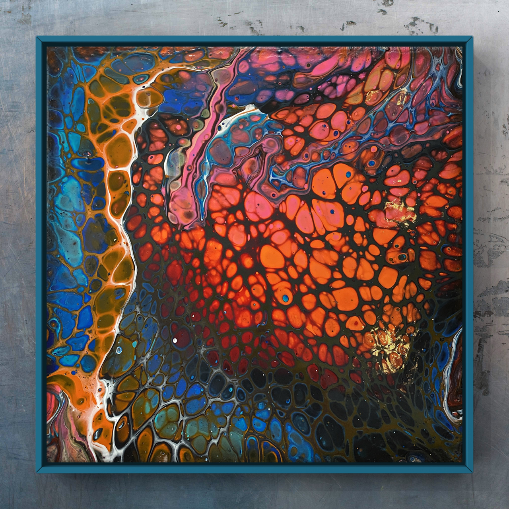
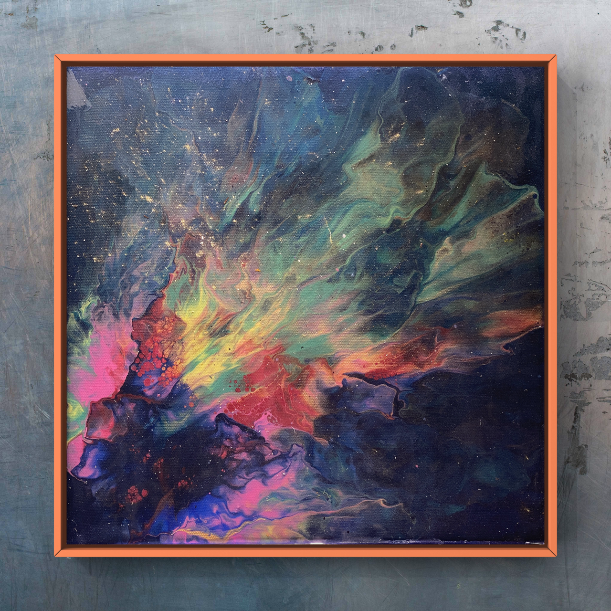

# Daniel Mo Houshmand

::::{grid-item-card}
:shadow: lg

```{admonition} Work in progress
- [x] Most of the site is in English, though you will find minor sections in Norwegian, primarily catering to the courses I tutor in *Fluid Art* at [tegenskole.no](http://www.tegneskole.no/).
- [x] I welcome and appreciate all forms of feedback - if you spot any errors, typos, or see opportunities for improvement, please do not hesitate to share!
```

::::

---

:::::{grid} 
::::{grid-item-card} **`Daniel Mo Houshmand`** *AKA* **`Mo`**
:img-top: img/particle_background.jpg
:shadow: lg

[](https://www.linkedin.com/in/mohoushmand/)
[](https://github.com/QDaria)
[](https://github.com/MoHoushmand)
[](https://www.facebook.com/DMoHoushmand)
[](https://www.instagram.com/mo_houshmand/)
[](https://www.instagram.com/mo_houshmand_art/)
[](https://mybinder.org/v2/gh/QDaria/jbmo/HEAD)
[](https://colab.research.google.com/github/googlecolab/colabtools/blob/main/notebooks/colab-github-demo.ipynb)
^^^

```{grid-item-card}

```


+++

:::{div} sd-text-center sd-text-primary sd-fs-6 sd-text-wrap sd-text-{black} sd-font-weight-bold
Welcome to my personal website & digital portfolio!
:::


## Background

I'm an artist at heart, with a diverse background in Applied Mathematics, Physics, Data Science, and Entrepreneurship. My journey began in art, evolving to appreciate the synergy between art and science, especially in Fluid Art and Fluid Mechanics.

I hold an MSc in Applied Mathematics, Mechanics & Numerical Physics from the University of Oslo (UiO), a BSc in Civil Engineering from Oslo and Akershus University College of Applied Sciences (HiOA), and a BA in Design & Modelling Techniques from ESMOD Bordeaux/Oslo. Additionally, I've earned numerous of professional certifications and spesialisations in Mathematics for Machine Learning, Quantum Machine Learning, and Quantum Computer Hardware from top leading universities.

## Achievements

I had the privilege of proofreading for Professor Hans Petter Langtangen, most notably his bestseller: "Finite Difference Computing with Partial Differential Equations - A Modern Software Approach".

In 2017, I joined as one of the first Data Scientists at the AI Lab funded by the Norwegian Labour and Welfare Administration (NAV). In 2022, I rejoined NAV, further enhancing my skills in data handling, infrastructure design, and full-stack development. My tenure at NAV was transformative, where I developed tools like 'Zipminator' for secure data handling and worked on various data science projects.

## Entrepreneurial Ventures

Between 2017-2021, I delved into quantum technologies. Initially, as the CTO of iProud, backed by Xplorico and Malaysian officials, we aimed to create a personal coach using hybrid machine learning algorithms. Later, as the CEO of QDaria, Norway's first Quantum Computer Company, our vision was to build a quantum computer to tackle complex global problems. QDaria comprised four departments: Quantum Computer Hardware Engineering, Quantum AI Lab, Synthetic Biology lab, and a Q-Investment Hub.

Our ultimate goal was to impact the health tech sector, focusing on bioinformatics, disease diagnosis, prediction, and drug discovery using ML, QML, and Quantum Computer Hardware.

## About This Website

Here, I share notes, codes, and resources in an interactive jupyterbook format, demystifying quantum subjects. Topics range from quantum mechanics basics to the potential of Anyons in quantum computation. I also discuss Turbulence Flows and the Navier-Stokes equations.

I invite you to explore and provide feedback. Dive into the intersection of art and science, and I hope you find both inspiration and knowledge.

## Interdisciplinary Pursuits

I'm deeply rooted in the belief that interdisciplinary collaboration unlocks the potential of emerging technologies. As an Artist, Applied Mathematician, Physicist, and Data Scientist, my work bridges the gap between Art and Science. This website is a testament to that, showcasing my artwork alongside analytical projects. My expertise encompasses Fluid Art, Fluid Mechanics, Turbulence Flow, Data Science, Computational Science, Quantum Computing, and more.

## Fluid Art & Fluid Mechanics

My courses on the artistic nuances of Fluid Art, currently in Norwegian, can be found at [tegneskole](tegenskole.no) . An English version is forthcoming. On the flip side, the scientific exploration of fluid mechanics, especially the interaction of acrylic colors with canvas, is available in English. While the former is visually engaging, the latter is technically intricate. It's a deep dive into applied mathematics and mechanics, but I encourage everyone to start with the basics and progress to the complex equations.

## From Turbulence to Quantum

My intrigue lies at the crossroads of science and art, turbulence flow, and quantum mechanics. This curiosity led me from the macroscopic world of classical physics to the microscopic realm of quantum mechanics. I'll share how my passion for High-Performance materials and Computational Fluid Dynamics (CFD) simulations of Turbulence Flows transitioned me into the quantum domain.

The mathematical backbone here is CFD and Direct Numerical Simulation (DNS), both dedicated to solving the Navier-Stokes equations. DNS, in particular, is a resource-intensive technique, with only a few globally having the means to simulate it.

## Quantum Exploration

Quantum Computers, set to reshape our technological future, are a primary focus of mine. I'll walk you through my quantum journey, from the basics to the intricacies of Quantum Machine Learning, and even Topological Quantum Computers (TQC). I'll delve into the mathematical underpinnings, from linear algebra to quantum circuits, and how they come alive in quantum hardware.

I've compiled a wealth of notes, codes, and resources on Quantum Computing, presented in an interactive JupyterBook format. This platform offers a deep dive into the world of quantum technologies.

A significant part of my portfolio revolves around Quantum Machine Learning and TQC, emphasizing the transformative potential of Anyons in quantum computation. I believe Anyon-based systems will lead the next quantum tech wave, and I aim to contribute meaningfully to this evolution.

## Engage & Learn

Mastering these subjects is challenging, but I'm here to guide you. With active engagement, visualization, and patience, you can grasp these intricate topics. Your consistent effort will make these concepts clearer over time.

I value your insights and feedback. If you have suggestions or corrections for any part of this website, please share.


```{epigraph}
Warm regards,

-- Mo
```

::::

:::::

---

::::{grid-item-card} Finite Element Artwork
:shadow: lg

```{grid-item-card}
:shadow: lg


+++
Optimised FEM geometry

- D. Mo Houshmand (2014)

::::

---

::::{grid-item-card} Dedication
:shadow: lg
I am a passionate supporter of education and personal growth I consider myself far too fortunate to have been guided by some of the most brilliant minds on the planet. I want to dedicate this space to these extraordinary individuals who, above all, set an example of kindness and respect for others, irrespective of their rank or status guided me to the topics that occupies most of my time and the vast majority of this space. Tragically, two of them passed away prematurely in 2017 and 2019.

## Hans Petter Langtangen (1962-2017)

First, I would like to honor my former professor and greatest inspiration, the exceptional awardwinning world reknowned proffessor, educator, vissionary and game changer [**Hans Petter Langtangen**](https://en.wikipedia.org/wiki/Hans_Petter_Langtangen), who lost his battle with pancreatic cancer in 2017. Astoundingly, he managed to write and finish a series of Springer published bestsellers in Scientific Computing and Engineering between being diagnosed in early 2015 and his untimely passing in the fall of 2017. An extraordinarily inspirational figure, he fostered an environment that encouraged you to perform above and beyond your perceived abilities. He held a firm belief that anyone, regardless of the difficulty of their goals, could succeed with dedication and hard work. A true genius in every sense, he had an unwavering conviction that there were no 'stupid' people and he could convince even the most self-doubting among us that we had the potential to achieve greatness. He was a part of the prestigious Center for Neuroplasticity and his teachings instilled in me a passionate love for Numerical Methods for Partial Differential Equations. I am immensely proud to have had the opportunity to proofread some of his writings, and to have contributed to his last authored bestseller, Finite Difference Computing with Partial Differential Equations - A Modern Software Approach. I think of him every single day with a mixture of grief and gratitude. Rest in Peace, Maestro!

---

## Peter Wittek (1980-2019)

Secondly, I wish to honor the memory of the adventurous and inspiring professor, [**Peter Wittek**](https://www.utoronto.ca/news/u-t-s-peter-wittek-who-will-be-remembered-feb-3-event-why-future-quantum) from the University of Toronto. He introduced me to Quantum Machine Learning back in 2017, when I had only just begun my earnest exploration of Machine Learning, Natural Language Processing, Topic Modelling, and Latent Dirichlet Allocation (LDA). At the time, I was an intern working as a Data Scientist in what was then the first officially funded AI Lab in Norway. Despite my novice status, I found Professor Wittek's teachings invaluable, due in large part to my background in physics which provided a foundation to grasp these complex concepts with considerable effort.

Unfortunately, Professor Wittek's life was tragically cut short in the devastating Himalayan avalanche of 2019. To this day, I carry a firm belief that had he still been with us, our third attempt to establish a Quantum Computing startup would have seen great success. His untimely demise is a profound loss to the scientific community and to everyone who had the privilege of knowing him personally or professionally. I shall always remember him, not just for his ground-breaking work in Quantum Machine Learning, but for his generosity in guiding me to navigate in this at that time completeley new emerging field during my early steps in the field, and later having faith in me and our maybe of hindsight overly ambitious attempt to pioneer the first Quantum Computer Company in Norway. May he rest in peace.

---

## Jon Magne Leinaas

I am priviliged to be able to acknowledge and salute my former professor in *Non-Relativistic Quantum Mechanics* (Moderne Quantum Mechanics). What a giant of a mentor and more importantly the very best example of homo sapiens [**Jon Magne Leinaas**](https://en.wikipedia.org/wiki/Jon_Magne_Leinaas) who, alongside with his buddy **Jan Myrheim** discovered **`Anyons`** for almost 50 years ago. Their discovery was independently confirmed twice in different labs during the pandemic (see for instance Welcome Anyons - Nature). Jon, a member of the Nobel Prize in Physics committee, and Jan have been strong candidates for the prestigious award. The discovery of Anyons, which bridges Fermions with Bosons, has the potential to revolutionize the field of Quantum Computing and could have an unparalleled, positive impact on humanity.

Upon covering the diverse array of qubit types, my attention will significantly shift towards Topological Quantum Computers. It is my intention to devote a considerable portion of my future work in this direction, to elucidate every facet of the groundbreaking discovery of Anyons - a new class of particles, represent a profound advancement in our understanding of quantum mechanics. They form the underlying theoretical basis for Topological Quantum Computers, a novel computing paradigm that leverages the unique properties of so called exotic quasi particles Anyons for computational tasks. As such, they embody a promising approach to realizing fault-tolerant quantum computation, which is one of the most significant challenges in the field.

I am strongly convinced that Topological Quantum Computers, powered by Anyon-based qubits, will lead the next wave of advancements in quantum computing. My conviction is based on their inherent fault tolerance and stability, characteristics that are quintessential for the operation of practical, large-scale quantum computers. Through this dedicated exploration, I aim to highlight the profound potential of Anyon-based Topological Quantum Computers and their potential to dominate the future of quantum computing. This exploration will not only pay homage to the remarkable work of Leinaas but also contribute to advancing our collective understanding of this promising technology. I sincerely believe that by shedding light on the intricacies of these systems, we can inspire and accelerate further research and development in this space, ultimately bringing us closer to the quantum future we all envision.

Finally I also want to express my gratitude to Delft University and edx for offering comprehensive, world-class courses in the field of Quantum Computing and Quantum Computer Technology. These resources have played an instrumental role in enabling me to grasp these fascinating yet incredibly complex subjects and this site is highly influenced from the courses they have offered. I highly recommend them to anyone interested in this field.

I hope you enjoy exploring this website and feel free to reach out to me if you have any questions or comments. Feel free to browse, learn, and connect with me as you explore the various facets of my life and work. Whether you're captivated by my artistic creations or intrigued by my technical expertise, I warmly invite you to embark on this journey with me and I am always delighted to connect with others who share my passion for learning, innovation, and positive impact. <br>

::::

---

::::{grid-item-card} Fluid Art (Bloom)
:shadow: lg

```{grid-item-card}
:shadow: lg

```

+++
Bad Bloom series

- D. Mo Houshmand**(2021)
::::

---

::::{grid-item-card} Fluid Art (Flip Cup) 
:shadow: lg

```{grid-item-card}
:shadow: lg

```

+++
Rajee's Torch 

- D. Mo Houshmand** (2019)

::::

---

```{tableofcontents}
```

---

::::{grid-item-card} Fluid Art (Dutch Pour)
:shadow: lg

```{grid-item-card}
:shadow: lg

```

+++

Northern Light Series 

- D. Mo Houshmand (2020)
  
::::


---

```{nb-exec-table}
```

---

:::{div} sd-text-center sd-text-primary sd-fs-6 sd-text-wrap sd-text-{black}
Ibis Redibis Nunquam Per Bella Peribis
:::
