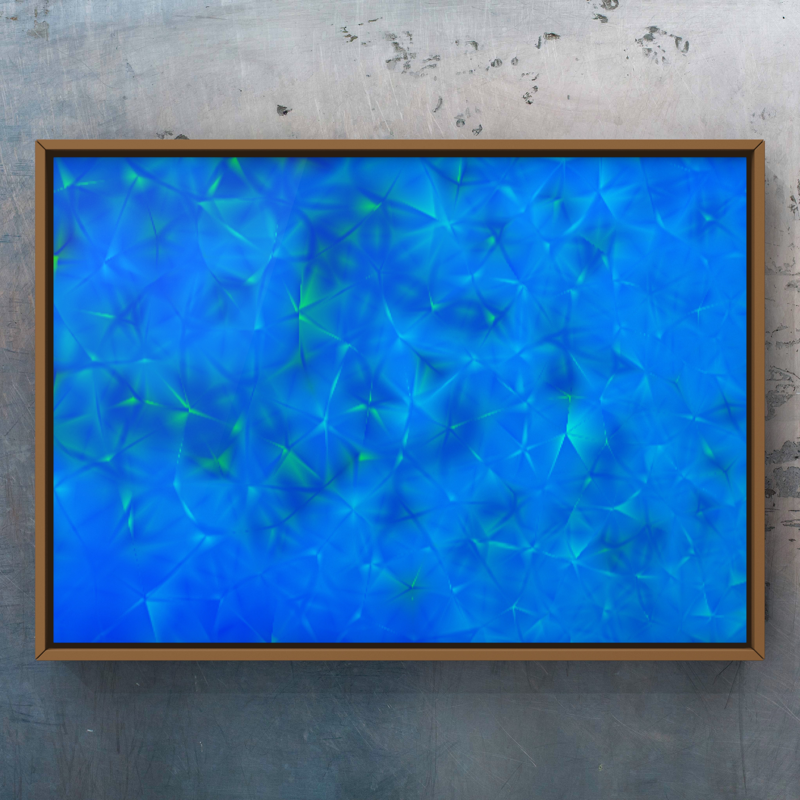

# Daniel Mo Houshmand


[](https://mybinder.org/v2/gh/QDaria/jbmo/HEAD)
[](https://colab.research.google.com/github/googlecolab/colabtools/blob/main/notebooks/colab-github-demo.ipynb)

---


---


```{note} Work in progress
**Work in progress!** <br>
- Welcome to my personal site which is in its infancy and under development. This space serves as a reflection of my interdisciplinary background, diverse skillset, and the projects that have shaped me.
- The vast majority of this site is in English but some minor parts of it is in Norwegian only at the moment for courses I'm tutoring in *Fluid Art* at [tegenskole.no](http://www.tegneskole.no/) <br> 
- The rest is a combination of my experience, educations and project in the realm of *Art*, *Applied Behavioral Analysis*, *Quantum Information*, *Data Science* and *Computational Science* with *Applied Mathematics, Mechanics and mostly Numerical Physics* plus some emerging and or established sub fields of *Artificial Intelligence*, better known as *Machine Learning* and *Deep Learning*.
- In my attempt to grasp the fundamentals of *Quantum Computing*, *Quantum Computers* and *Quantum Machine Learning* I have literally been taken thousand of pages of notes, codes and other recourses wher I have worked through tons of exercises. All that will be the heart of what I want to share with the readers in this jupyterbook format that enables flexibility to build a more instructively, interactive and visually appealing book at a later stage to make it easier to grasp for others who want to learn more about these subjects so you don't suffer as much as I did due to the complexity and hardness of it. 
- However, I have to painfully admit that this is not an easy to read or grasp subject, and you will no matter patiently work hard to fascilitate the subjects to be sufficiently matured. To cliche; The more regularly you work through exercises and read other resources the faster and heavier you will comprehend. 
- Any errors, typos or any shape of improvements are more than highly appreciated! <br>

Kind regards 

- **Daniel Mo Houshmand** 
- **mo@daria.com**
- **mob: $+47 98079896$**

```

---

```{grid-item-card}
:shadow: lg

```

> Finite Element Artwork of an *Optimised FEM geometry prepared fo Direct Numerical Simulation (DNS)*  to be solved directly with *the Navier-Stokes equations* <br> - **D. Mo Houshmand** (2014)

---
As a firm believer in social responsibility, a portion of this website will dedicate to my charity work and ongoing commitment to helping those in need. Join me in my efforts to create positive change and empower others to reach their full potential.

I am also a strong believer in the power of interdisciplinary collaboration and the potential of emerging technologies to create positive changes.
Here, you will find a showcase of some of my Artwork, highlighting my love for `Art & Science`. How I approach, start and finnish off a creative processes end-to-end, and discover how I made some of the pieces that have been a significant part of my personal and professional growth, and that I personally have found captivating. <br>

Especially I will emphesise my passion for Quantum Computing, Quantum Machine Learning and the Hardware of Quantum Computers. No shame in the game I will also briefly share how I failed big-time all three times in my wholeheartedly attempt to establish the first Quantum Computer startup in Norway. In the process I've gained invaluable experience where by exploiting both my weaknesses and strengths, from overestiming certain abilities to underestimating other ones.

Feel free to browse, learn, and connect with me as you explore the various facets of my life and work. Whether you are drawn to my artistic creations or intrigued by my technical expertise, I invite you to share in my journey and passion for learning, innovation, and positive impact.

---


**Dedication:** <br>

I have been outmost fortunate to have learned by some of the most brilliant minds in this planet, so I want to dedicate this space to these rare personalities that first and foremost benchmarked kindness and how to respectfully treat others no matter how high ranked they where. Unfortunately two of them have passed away way too prematurely in 2017 and 2019.

First my former professor and my biggest inspirator and motivator; the great **Hans Petter Langtangen** who lost the battle to pancrea cancer in 2017. Amazingly he managed to write and finnish of a series of Springer published bestsellers in *Scientific Computing and Engineering* in the period between being diagnosed in early 2015 until he passed away in fall 2016. He was a contagiously extraterestial inspiring peoples whisperer that made you perform above and beyond abilities and had this belief that anyone who really wanted something no matter how hard it was would succeed with dedication and required workload. A true and rare genius! In his mind there was no stupid people and convinced you that no matter how dumb and incompetent you think you are he would prove you wrong. And he convinced you! The electric propogation in his brain had the power to light up aapproximately a $20$ Watt bulb, which is more or less the same as every single person on this planet. The only difference, much like a finger print is the wiring of how thee neural network in our brains manifested itself depending on our habits which gives us the uniquenes as a person. He knew exactly what he was talking about and was even appointed as one of a handfull in the newly established and prestigous *Center of Neuroplasticity* before he passed away. He made me passionly love *Numerical Methods for Partial Differential Equations* and trusted me to proof read some of his writings. At that time a more than I even trusted in myself. I gladly read every single compendium, article and book he asked me to read and give feedback mostly in Applied Mathematics, Computational Science and Engineering. The week before he died he even signed his last authored bestseller book *Finite Difference Computing with Partial Differential Equations - A Modern Software Approach* and included me in the Acknowledgement for my contributions in a series of compendiums which resulted in a book. I was and still is overwhelmingly proud and will be to the end of time, being associated with such a world class person and a superstar of a human being. I think of him every single day with a mixture of greef and gratitude. Rest in Peace maestro!

Another one is the adventurer and professor **Peter Wittek** from the University of Toronto who introduced me to Quantum Machine Learning in 2017. A man who had the same spirit as Hans Petter and who passed tragically away by that horrendous fall of 2019 Himalaya Avalanch. I'm certain that our last and third attempt to establish the Quantum Computer startup would have been a success if he had been alive. May he rest in peace.

Last but not least my former professor in "Modern Quantum Mechanics" (renamed to "Non-Relativistic Quantum Mechanics") and a giant of a mentor **Jon Magne Leinaas** who discovered **Anyons** together with **Jan Myrheim** almost 50 years ago which was confirmed independently twice in different labs during the pandemic (see for instance *Welcome Anyons* - Nature). He sits in the Nobel Price in Physics comitee and together with Jan Myrheim have been one of the strongest candidates to get the Nobel Price in Physics. No one will be surprised if they deservedly finally get that highest acnowledgemnt there in Physics. To put that discovery in perspective; we have **Fermions** like protons, electrons and so on described by *Fermi-Dirac* statistic and **Bosons** by Bose-Einstein. Anyons introduced a third one in that cathegoryc that bridges Fermions with Bosons that can take the shape of any of those. The size of this discovery is out of charts which is the most promising candidate of one day building a full scale Fault-Tolerent Quantum Computer with sufficiently enough qubits to have a unparalell dramatic impact for humanity in a positive fashion<br>

The rest of the acknowledgement goes to **Delft** university and **edx** for offering comprehensive and without doubt world class courses in the realm of Quantum Computing and Quantum Computer Technology which has enabled me to better grasp these amazingly exciting but extremely hard subjects. I have taken some of them and I can't recommend them enough.

I hope you njoy your stay and feel free to reach out to me if you have any questions or comments. I am always happy to connect with others who share my passion for learning, innovation, and positive impact.

- Mo
  
> Ibis Redibis Nunquam Per Bella Peribi

```{tableofcontents}
```


```{nb-exec-table}
```


